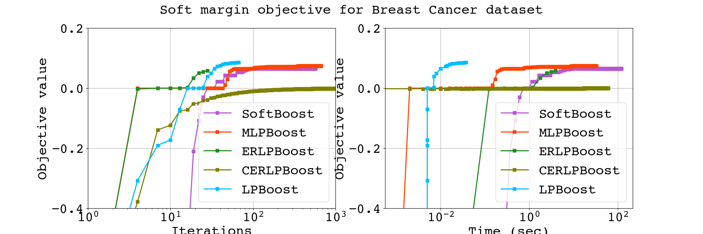
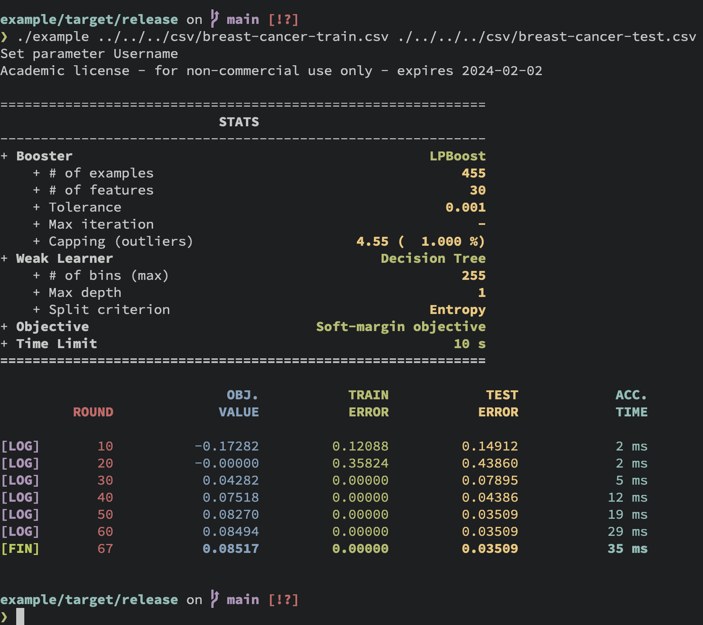

# MiniBoosts
**A collection of boosting algorithms written in Rust 🦀.**




**Note.** 
The algorithms depicted in above figure are aborted after 1 minutes, 
so some algorithms cannot reach their optimal value.

Some boosting algorithms use [Gurobi optimizer](https://www.gurobi.com), 
so you must acquire a license to use this library. 
If you have the license, you can use these boosting algorithms (boosters) 
by specifying `features = ["extended"]` in `Cargo.toml`.

**Note.** 
If you are trying to use the `extended` feature without a Gurobi license, 
the compilation fails.

# Why MiniBoosts?
I, a Ph.D. student, 
needed to implement boosting algorithms 
to show the effectiveness of a proposed algorithm. 
Some boosting algorithms 
for empirical risk minimization are implemented in Python 3, 
but three main issues exist.
- They are dedicated to boosting algorithm users, not to developers. 
    Most algorithms are implemented by C/C++ internally, 
    so implementing a new boosting algorithm by Python 3
    results in a slow running time.
- These boosting algorithms are designed 
    for a decision-tree weak learner 
    even though the boosting protocol does not demand.
- There is no implementation for margin optimization boosting algorithms. 
    Margin optimization is a better goal than empirical risk minimization 
    in binary classification.

MiniBoosts is a crate to address the above issues.
This crate provides:
- Two main traits, named Booster and WeakLearner,
    Some famous boosting algorithms,
    including AdaBoost, LPBoost, ERLPBoost, etc.
- Some weak learners, including Decision-Tree, Regression-Tree, etc.

Also, one can implement a new Booster or Weak Learner 
by implementing the above traits.

You can use `Logger` struct to output log to `.csv` file,
while printing the status like this:



See [Research feature](#research-feature) section for detail.

## Features
Currently, I implemented the following Boosters and Weak Learners.

If you invent a new boosting algorithm,
you can introduce it by implementing `Booster` trait.
See `cargo doc -F extended --open` for details.

### Boosters

|`BOOSTER` | `FEATURE FLAG` |
| :---     | :---           |
| [AdaBoost](https://www.sciencedirect.com/science/article/pii/S002200009791504X?via%3Dihub)<br>by Freund and Schapire, 1997 | |
| [AdaBoostV](http://jmlr.org/papers/v6/ratsch05a.html)<br>by Rätsch and Warmuth, 2005 | |
| [SmoothBoost](https://link.springer.com/chapter/10.1007/3-540-44581-1_31)<br>by Rocco A. Servedio, 2003 | |
| [TotalBoost](https://dl.acm.org/doi/10.1145/1143844.1143970)<br>by Warmuth, Liao, and Rätsch, 2006 | `extended` |
| [LPBoost](https://link.springer.com/content/pdf/10.1023/A:1012470815092.pdf)<br>by Demiriz, Bennett, and Shawe-Taylor, 2002 | `extended` |
| [SoftBoost](https://proceedings.neurips.cc/paper/2007/file/cfbce4c1d7c425baf21d6b6f2babe6be-Paper.pdf)<br>by Warmuth, Glocer, and Rätsch, 2007 | `extended` |
| [ERLPBoost](https://www.stat.purdue.edu/~vishy/papers/WarGloVis08.pdf)<br>by Warmuth and Glocer, and Vishwanathan, 2008 | `extended` |
| [CERLPBoost](https://link.springer.com/article/10.1007/s10994-010-5173-z) (Corrective ERLPBoost)<br>by Shalev-Shwartz and Singer, 2010 | `extended` |
| [MLPBoost](https://arxiv.org/abs/2209.10831)<br>by Mitsuboshi, Hatano, and Takimoto, 2022 | `extended` |
| [GBM](https://projecteuclid.org/journals/annals-of-statistics/volume-29/issue-5/Greedy-function-approximation-A-gradient-boostingmachine/10.1214/aos/1013203451.full) (Gradient Boosting Machine),<br>by Jerome H. Friedman | |
| [GraphSepBoost](https://theoretics.episciences.org/10757) (Graph Separation Boosting)<br>by Noga Alon, Alon Gonen, Elad Hazan, and Shay Moran, 2023 | |


**Note.** Currently, `GraphSepBoost` only supports the aggregation rule
shown in Lemma 4.2 of their paper.


### Weak Learners
|`WEAK LEARNER`                                                                                                       |
| :---                                                                                                                |
| [DecisionTree](https://www.amazon.co.jp/-/en/Leo-Breiman/dp/0412048418) (Decision Tree)                             |
| [RegressionTree](https://www.amazon.co.jp/-/en/Leo-Breiman/dp/0412048418) (Regression Tree)                         |
| [BadWeakLearner](https://papers.nips.cc/paper_files/paper/2007/hash/cfbce4c1d7c425baf21d6b6f2babe6be-Abstract.html) |
| GaussianNB (Gaussian Naive Bayes)                                                                                   |
| NeuralNetwork (Neural Network, Experimental)                                                                        |


## Future work

- Boosters
    - [AnyBoost](https://www.researchgate.net/publication/243689632_Functional_gradient_techniques_for_combining_hypotheses)
    - [SparsiBoost](http://proceedings.mlr.press/v97/mathiasen19a/mathiasen19a.pdf)


- Weak Learners
    - Bag of words
    - TF-IDF
    - [RBF-Net](https://link.springer.com/content/pdf/10.1023/A:1007618119488.pdf)


- Others
    - Parallelization
    - LP/QP solver (This work allows you to use `extended` features without a license).


## How to use
You can see the document by `cargo doc --open` command.  

You need to write the following line to `Cargo.toml`.

```TOML
miniboosts = { version = "0.3.0" }
```

If you want to use `extended` features, such as `LPBoost`, specify the option:

```TOML
miniboosts = { version = "0.3.0", features = ["extended"] }
```


Here is a sample code:

```rust
use miniboosts::prelude::*;


fn main() {
    // Set file name
    let file = "/path/to/input/data.csv";

    // Read a CSV file
    // The column named `class` corresponds to the labels (targets).
    let has_header = true;
    let sample = Sample::from_csv(file, has_header)
        .unwrap()
        .set_target("class");


    // Set tolerance parameter as `0.01`.
    let tol: f64 = 0.01;


    // Initialize Booster
    let mut booster = AdaBoost::init(&sample)
        .tolerance(tol); // Set the tolerance parameter.


    // Construct `DecisionTree` Weak Learner from `DecisionTreeBuilder`.
    let weak_learner = DecisionTreeBuilder::new(&sample)
        .max_depth(3) // Specify the max depth (default is 2)
        .criterion(Criterion::Twoing) // Choose the split rule.
        .build(); // Build `DecisionTree`.


    // Run the boosting algorithm
    // Each booster returns a combined hypothesis.
    let f = booster.run(&weak_learner);


    // Get the batch prediction for all examples in `data`.
    let predictions = f.predict_all(&sample);


    // You can predict the `i`th instance.
    let i = 0_usize;
    let prediction = f.predict(&sample, i);
}
```


**Note:** Currently, The regression tree is under re-desining,
so one cannot use it in similarly.


If you use boosting for soft margin optimization, 
initialize booster like this:
```rust
let n_sample = sample.shape().0;
let nu = n_sample as f64 * 0.2;
let lpboost = LPBoost::init(&sample)
    .tolerance(tol)
    .nu(nu); // Setting the capping parameter.
```

Note that the capping parameter must satisfies `1 <= nu && nu <= n_sample`.


## Research feature
When you invent a new boosting algorithm and write a paper,
you need to compare it to previous works to show the effectiveness of your one.
One way to compare the algorithms is
to plot the curve for objective value or train/test loss.
This crate can output a CSV file for such values in each step.

Here is an example:
```rust
use miniboosts::prelude::*;
use miniboosts::research::Logger;
use miniboosts::common::objective_functions::SoftMarginObjective;


// Define a loss function
fn zero_one_loss<H>(sample: &Sample, f: &CombinedHypothesis<H>) -> f64
    where H: Classifier
{
    let n_sample = sample.shape().0 as f64;

    let target = sample.target();

    f.predict_all(sample)
        .into_iter()
        .zip(target.into_iter())
        .map(|(fx, &y)| if fx != y as i64 { 1.0 } else { 0.0 })
        .sum::<f64>()
        / n_sample
}


fn main() {
    // Read the training data
    let path = "/path/to/train/data.csv";
    let has_header = true;
    let train = Sample::from_csv(path, has_header)
        .unwrap()
        .set_target("class");

    // Set some parameters used later.
    let n_sample = train.shape().0 as f64;
    let nu = 0.01 * n_sample;


    // Read the test data
    let path = "/path/to/test/data.csv";
    let has_header = true;
    let test = Sample::from_csv(path, has_header)
        .unwrap()
        .set_target("class");


    let booster = LPBoost::init(&train);
    let weak_learner = DecisionTreeBuilder::new(&train)
        .max_depth(2)
        .criterion(Criterion::Entropy)
        .build();

    // Set the objective function.
    // One can use your own function by implementing ObjectiveFunction trait.
    let objective = SoftMarginObjective::new(nu);

    let mut logger = Logger::new(
            booster, tree, objective, zero_one_loss, &train, &test
        )
        .time_limit_as_millis(120_000) // Terminate in 120 seconds.
        .print_every(10); // Print log every 10 rounds.

    // Each line of `lpboost.csv` contains the following four information:
    // Objective value, Train loss, Test loss, Time per iteration
    // The returned value `f` is the combined hypothesis.
    let f = logger.run("lpboost.csv");
}
```

Further, one can log your algorithm by implementing `Research` trait.

Run `cargo doc -F extended --open` to see more information.
